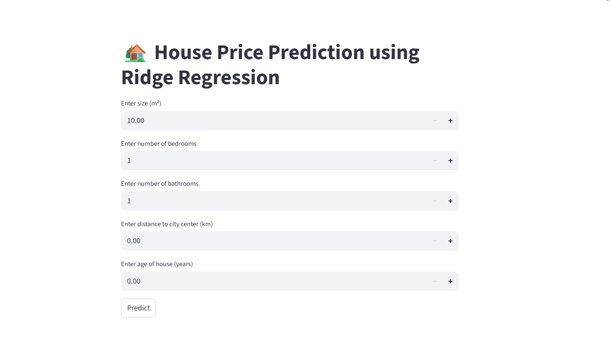

House Price Prediction using Ridge Regression

This project is a Machine Learning web app built with Streamlit that predicts house prices based on user inputs such as size, number of bedrooms, bathrooms, distance to the city center, and the age of the house. The model is trained using Ridge Regression.

🔗 **Live Demo:** [House Price Prediction App](https://predicting-house-prices-using-ridge-regression-4yklzstyqucgn6g.streamlit.app/)

📌 Features

Simple Streamlit interface for entering house details.

Predicts house price instantly using a pre-trained Ridge Regression model.

Clean and responsive UI.

Runs seamlessly on Streamlit Cloud.

⚙️ How It Works

Input house details:

Size (m²)

Number of Bedrooms

Number of Bathrooms

Distance to City Center (km)

Age of House (years)

Click Predict.

The app outputs the predicted house price 💰.

🛠️ Tech Stack

Python 3

Streamlit – Web app framework

NumPy – Numerical computation

scikit-learn – Ridge Regression model

Pickle – Model serialization

📂 Project Structure
├── application.py        # Main Streamlit app
├── ridge_model.pkl       # Trained Ridge Regression model
├── requirements.txt      # Dependencies
└── README.md             # Project documentation

🚀 Run Locally

Clone the repository and run the app locally:

# Install dependencies
pip install -r requirements.txt

# Run the Streamlit app
streamlit run application.py

📸 Screenshots
App Interface

📈 Model

The model used is Ridge Regression, a linear regression variant with L2 regularization.

Helps reduce overfitting by penalizing large coefficients.

Trained on a dataset of house prices with features such as size, bedrooms, bathrooms, location distance, and age.

📬 Author

👤 [Your Name]
🔗 LinkedIn
 | GitHub

✨ If you found this project useful, don’t forget to star ⭐ the repo!